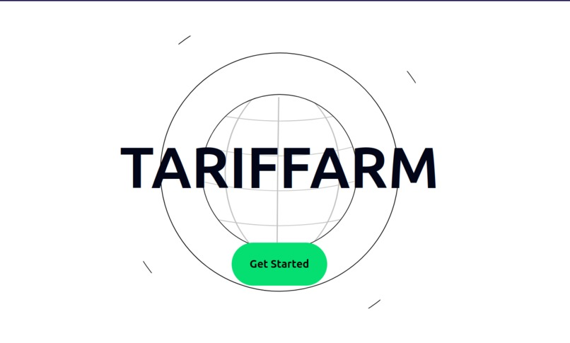
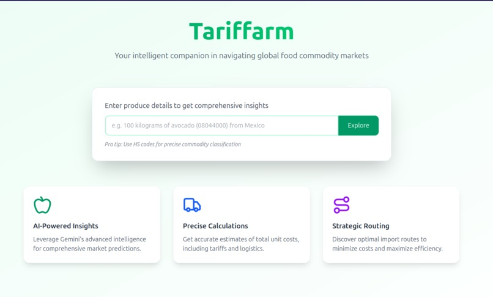
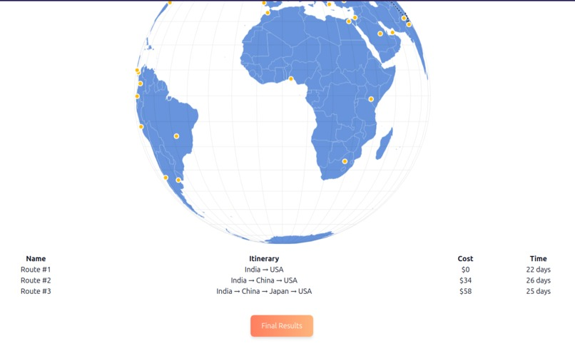

# 🌾 **Tariffarm**

Tariffarm is a web-based platform designed to provide clarity and insight for agricultural trade.  
It helps smallholder farmers, exporters, and traders to:

- 📦 Calculate **applicable tariffs, duties, and regulatory fees**
- 🛳 Discover **optimal shipping routes** (land, sea, air)
- 🗺 Visualize **ports, customs points, logistics hubs**
- 💸 Estimate **total cost** and **delivery time**
- 📊 See **detailed cost breakdowns** for freight, handling, permits, customs

This project was a submission for WildHacks 2025, and won 3rd place overall.<br>

[Devpost Link](https://devpost.com/software/idk-yet-o67hj8)

---

## **Key Features**
✅ **Secure login with Auth0**  
✅ **Protected/private API endpoints**  
✅ **Interactive 3D globe (amCharts)**  
✅ **Dynamic node coloring & selection**  
✅ **Animated trade routes with airplane icons**  
✅ **City-level and country-level mapping**

---

## **Demo Video**
[Watch on YouTube](https://www.youtube.com/watch?v=bZZq8BTu3Vk)

[](https://www.youtube.com/watch?v=bZZq8BTu3Vk)

---

## **Screenshots**

### Home Input & Insights


### 3D Globe with Routes & Table


### Landing Page


---

## **Tech Stack**
| Technology | Purpose |
|------------|---------|
| **Python (Flask)** | Backend API + Auth0 integration |
| **React + Next.js** | Dynamic frontend UI |
| **amCharts 5** | 3D map & globe visualizations |
| **Tailwind CSS** | Responsive styling |
| **Vercel** | Deployment |
| **Auth0** | Authentication |
| **Gemini AI** | Logic augmentation |

---

## **New Features**
- 🌟 Dynamic **city node highlighting** on 3D globe
- 🌟 Animated arrows with **custom airplane SVGs**
- 🌟 Final result button triggers backend **cost calculation**
- 🌟 Expanded city/country support (50+ nodes)
- 🌟 Improved **zoom and rotation controls**

---

## ⚙ **How to Run Locally**
```bash
# Backend
cd backend
python -m venv venv
source venv/bin/activate  # On Windows: venv\Scripts\activate
pip install -r requirements.txt
flask run

# Frontend
cd frontend
npm install
npm run dev
```

---

## Team

- Ayush - Backend
- Nathan - Frontend
- Samuel - Fullstack
- Yamaan - Project Manager and Designer
